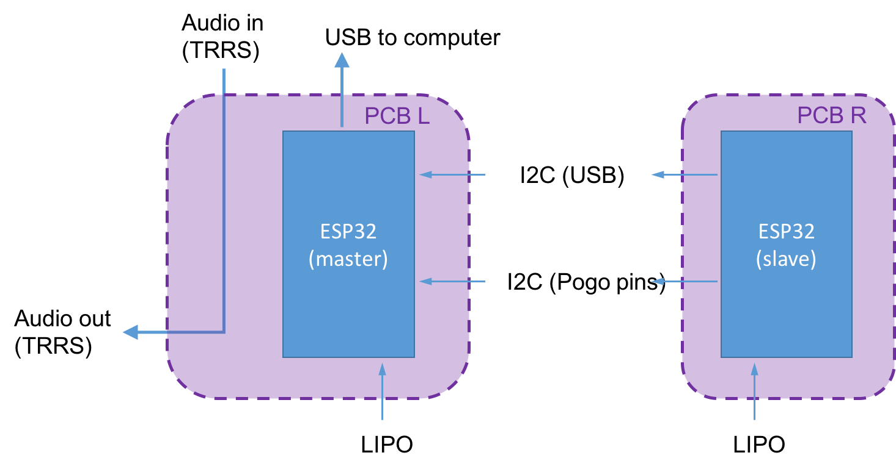
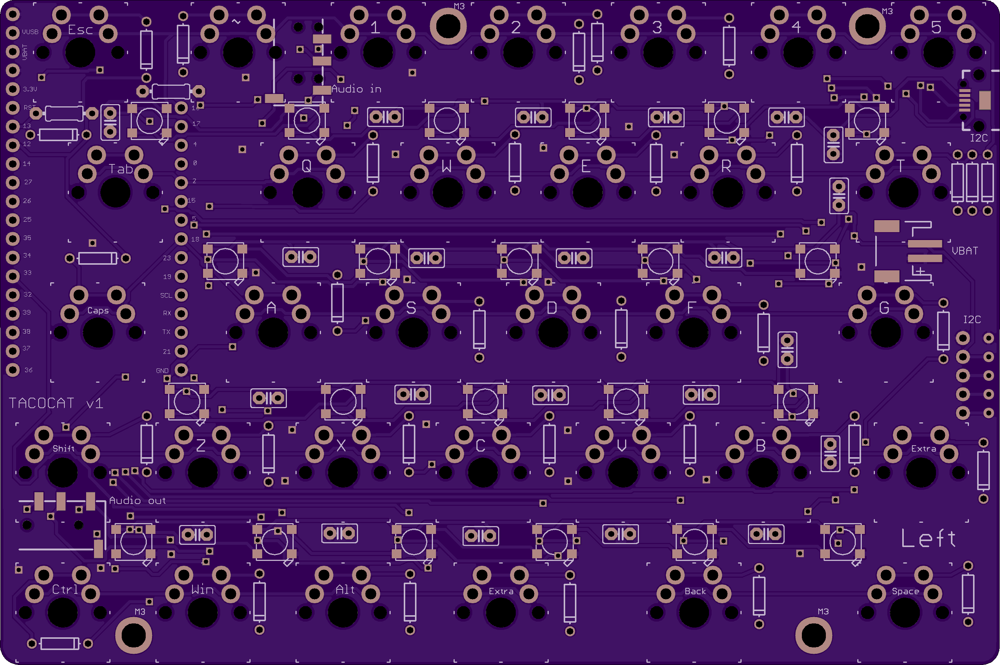
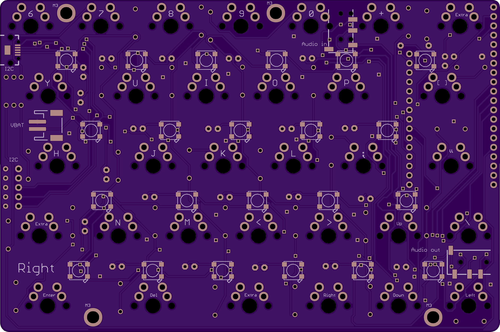

# PCB

The PCB was designed to be symmetric so that the same half could be used for both the left and the right side of the keyboard; the PCB simply needs to be flipped over depending on the side that is used.

Features:
- two symmetric keyboard halves
- wireless or powered operation
- wifi & bluetooth connected
- can be used as two halves with a TRRS audio cable or as single joined keyboard (no cable needed)
- audio passthrough

The board can be ordered from OshPark by clicking the image below.

<a href="https://oshpark.com/shared_projects/jsQ9hCTr"></img></a>

## Notes

To populate, place all Cherry MX switches, LEDs, diodes, capacitors and resistors on the *top* side of the board; the ESP32 and all IO jacks are placed on the *bottom* of the PCB.

Also:
- the top TRRS jack may hit one of the alignment pins of the switch; this pins may have to be manually cut
- the male I2C connection has plastic alignment pins that will only fit into the PCB after the two existing holes (used by the female end) are drilled out to a diamter of 1mm

## BOM

The items listed below are for two keyboard halves; an [online BOM](https://www.digikey.com/classic/RegisteredUser/BOMBillOfMaterials.aspx?path=1&exist=1&id=5155922) has also been generated for ease of purchase.

**NOTE:** the list below includes various USB & TRRS jacks needed to build custom cables for the project, however the list does not include the wires needed to build the cables.

Item | Quantity | Link
--- | --- | ---
LED | 44 | [digikey](https://www.digikey.com/product-detail/en/adafruit-industries-llc/1655/1528-1104-ND/5154679)
switch | 64 | [digikey](https://www.digikey.com/product-detail/en/cherry-americas-llc/MX1A-E1NW/CH197-ND/20180)
TRRS jack | 4 | [digikey](https://www.digikey.com/product-detail/en/cui-inc/SJ2-3574A-SMT-TR/CP-SJ2-3574A-SMT-CT-ND/6619586)
male I2C | 1 | [digikey](https://www.digikey.com/product-detail/en/mill-max-manufacturing-corp/829-22-005-20-001101/ED90506-ND/2416226)
female I2C | 1 | [digikey](https://www.digikey.com/product-detail/en/mill-max-manufacturing-corp/399-10-105-10-008000/ED8305-ND/4456255)
USB jack female | 2 | [digikey](https://www.digikey.com/product-detail/en/cui-inc/UJ2-MIBH2-4-SMT-TR/102-4007-1-ND/6187929)
battery jack | 2 | [digikey](https://www.digikey.com/product-detail/en/jst-sales-america-inc/S2B-PH-SM4-TB(LF)(SN)/455-1749-1-ND/926846)
ESP32 board | 2 | [digikey](https://www.digikey.com/product-detail/en/sparkfun-electronics/DEV-13907/1568-1444-ND/6419476)
capacitor | 44 | [digikey](https://www.digikey.com/product-detail/en/avx-corporation/SR205E104MAR/478-3192-ND/936834)
resistor | 2 | [digikey](https://www.digikey.com/product-detail/en/yageo/CFR-50JB-52-330K/330KH-ND/1634)
diode | 64 | [digikey](https://www.digikey.com/product-detail/en/fairchild-on-semiconductor/1N4148/1N4148FS-ND/458603)
LIPO | 2 | [digikey](https://www.digikey.com/product-detail/en/sparkfun-electronics/PRT-08483/1568-1487-ND/5271295)

## Layout

#### Circuit schematic

#### PCB top

#### PCB bottom

